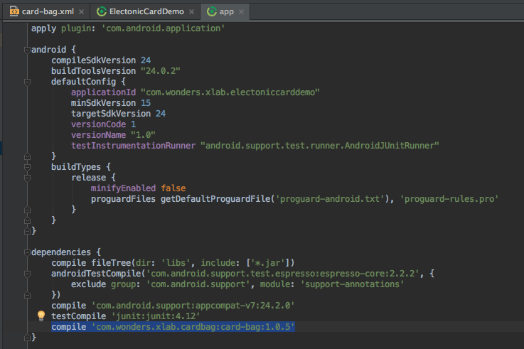

# 电子会员卡SDK使用文档
[  ](https://bintray.com/mzhua/maven/card-bag/_latestVersion)

[Demo地址](https://github.com/mzhua/ElectronicCardDemo)
## 版本支持
minSdkVersion 15

---

##  接入方式

### Android Studio

* 在module的`build.gradle`中加入依赖

   `compile 'com.wonders.xlab.cardbag:card-bag:lastestVersion'`
   
   ***lastestVersion就是顶部Download后面的数字***
   
   如图
   
   

---

## 如何调用

* 打开电子会员卡

	```
	CBag.get().start();
	```
	
* 直接调用扫一扫

	```
	XQrScanner.getInstance().startForResult(this, 12);
	```

* 重写`onActivityResult`接收扫描条形码结果,返回结果为字符串（如果没有单独的调用扫描条形码模块的功能，则不需要添加）

	```
	@Override
    protected void onActivityResult(int requestCode, int resultCode, Intent data) {
        super.onActivityResult(requestCode, resultCode, data);
        if (requestCode == 12 && resultCode == RESULT_OK) {
            String result = data.getStringExtra(XQrScanner.EXTRA_RESULT_BAR_OR_CODE_STRING);
            Toast.makeText(this, result, Toast.LENGTH_SHORT).show();
        }
    }
	```

---

## 设置自定义属性

电子会员卡SDK可以自定义3个属性，主要是为了最大程度的配合APP的设计，具体可自定义属性如下

 属性名 | 资源类型 | 解释 | 默认值 | 可用值
:-------------: | :-------------: | :-------------: | :-------------: | :-------------:
cbTopBarTitleColor | `color` | TopBar标题颜色（返回按钮和菜单的颜色也是随着标题颜色）| `@color/cbTextBlack` |颜色资源
cbTopBarBackground | `color` | TopBar背景颜色 | `@android:color/white` | 颜色资源
cbTopBarGravity | `integer` | TopBar标题的对齐方式 | `@integer/cbTopBarGravityLeft` | `@integer/cbTopBarGravityLeft`、`@integer/cbTopBarGravityCenter`

----

## 自定义搜索接口

电子会员卡中有一个搜索界面，可以根据输入的卡片名称进行搜索，如果需要提供搜索功能，则通过下面方法来进行（不实现下面功能也可以进行完整的流程，只是搜索界面只能添加空白的新卡片，无法选择预设的模板卡片）

1. 新建一个类，并且实现`CardSearchContract.Model`接口。在其中完成卡片的搜索功能，查询结束后，调用`callback.onSuccess`进行回调即可

	```
public class CardSearchModelImpl implements CardSearchContract.Model {
    /**
     * TODO
     * 此处仅为模拟数据,具体数据来源可以自行修改,数据请求完毕后调用 callback.onSuccess进行回调即可
     * @param cardName
     * @param callback
     */
    @Override
    public void searchByCardName(String cardName, Callback<List<CardSearchEntity.ResultsEntity>> callback) {
        List<CardSearchEntity.ResultsEntity> cards = new ArrayList<>();
        for (int i = 0; i < 10; i++) {
            CardSearchEntity.ResultsEntity entity = new CardSearchEntity.ResultsEntity();
            entity.setCard_img_url("http://img.taopic.com/uploads/allimg/121217/267860-12121H0414065.jpg");
            entity.setCard_name("name" + i);
            entity.setObjectId("" + i);
            cards.add(entity);
        }
        callback.onSuccess(cards);
    }

    @Override
    public void onDestroy() {

    }
}
```

2. 初始化CBag时设置搜索接口的实现

	```
	CBag.get()
                .setCardSearchModel(new CardSearchModelImpl())
                .start(this);
	```

---

## 如何同步数据

为了尽量简化SDK，所有数据不会再SDK内部进行网络操作，数据都是暂时缓存在`sqlite`中，图片则缓存在APP的私有空间。下面为具体的数据同步的方法。

利用`CBDataSyncHelper`中的两个方法进行操作


### 取出SDK中的数据

**_建议在从电子会员卡界面退出时，对数据进行保存。_**

对于本地拍摄的卡片正反面图片，`CardEntity`中会保存其图片文件的路径，如需要将卡片数据中的图片上传，则通过方法的`getFrontImgFilePath`和`getBackImgFilePath`获取路径，然后自行完成上传操作,成功后设置标识`CBDataSyncHelper.getInstance(this).hasSyncCardData(boolean hasSyncCardData)`表示已经同步完成，这样在没有修改的情况下将会返回`null`，省去每次保存到服务器的开销

```
	/**
     * 获取SDK中缓存的数据
     * @param view
     */
    public void fetchData(View view) {
        List<CardEntity> allCardsInfo = CBDataSyncHelper.getInstance(this).getAllCardsInfo();
        //do something
        CBDataSyncHelper.getInstance(this).hasSyncCardData(boolean hasSyncCardData)
    }
```

### 将APP在服务器中存储的数据同步到SDK中进行本地保存
***一定要设置`CardEntity`的id***

从服务器获取的数据因为不一定存在本地缓存图片，所以对于卡片正反面图片则通过设置url即可，`setFrontImgUrl`和`setBackImgUrl`分别设置正反面的图片链接

```
	/**
     * 将服务器保存的数据同步缓存到SDK中
     * @param view
     */
    public void saveData(View view) {
        List<CardEntity> cardEntities = new ArrayList<>();
        CBDataSyncHelper.getInstance(this).updateCardsInfo(cardEntities);
    }
```

---

## Proguard配置

```
-dontwarn okio.**
-keep class okio.**{*;}
-keep class com.squareup.** {*;}
```

## lint

如果lint报错，则在module的`build.gradle`加上

```
android{
	lintOptions {
        abortOnError false
    }
}
```

